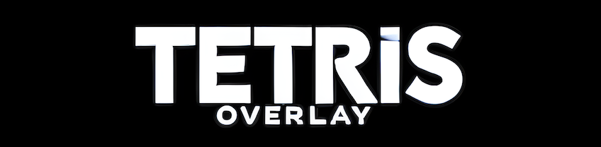

# Tetris Overlay (HOS 16.0.0+)
[](https://gbatemp.net/forums/nintendo-switch.283/?prefix_id=44)
[](https://github.com/topics/cpp)
[](https://www.gnu.org/licenses/old-licenses/gpl-2.0.en.html)
[](https://github.com/ppkantorski/Tetris-Overlay/releases/latest)
[](https://github.com/ppkantorski/Tetris-Overlay/graphs/traffic)
[](https://github.com/ppkantorski/Tetris-Overlay/issues)
[](https://github.com/ppkantorski/Tetris-Overlay/stargazers)

[](https://gbatemp.net/threads/tetris-overlay.661021/)

An Ultrahand-enhanced Tesla overlay that brings classic Tetris gameplay to the overlay menu. This overlay allows for in-menu gameplay with dynamic UI elements, saving and loading of game state, and high score tracking.

## Screenshot
[](https://gbatemp.net/threads/tetris-overlay.661021/)

## Features

- **Ultrahand Integration:** Enhanced with Ultrahand libraries for smooth and seamless gameplay with Ultrahand system settings and improved rendering.
- **Classic Tetris Mechanics:** Enjoy traditional Tetris gameplay, including line clears, level progression, and scoring.
- **Dynamic UI:** Provides a responsive interface with previews of the next and stored Tetriminos.
- **Save and Load:** Save your game progress and load previous games seamlessly.
- **Pause and Resume:** Easily pause and resume the game without losing progress.
- **High Score Tracking:** Tracks your highest score across sessions.
- **In-Game Access:** Launch the overlay directly within games using Ultrahand Overlay (or Tesla Menu).

## Installation

1. Ensure you have a homebrew-enabled Nintendo Switch with [Ultrahand Overlay](https://github.com/ppkantorski/Ultrahand-Overlay) (or Tesla Menu) installed.
2. Download the latest release of Tetris Overlay from the [Releases](https://github.com/ppkantorski/Tetris-Overlay/releases).
3. Copy `tetris.ovl` to the `sdmc:/switch/.overlays/` directory on your Nintendo Switch's SD card.
4. Open the [Ultrahand Overlay](https://github.com/ppkantorski/Ultrahand-Overlay) (or Tesla Menu) and launch the Tetris Overlay.

## Controls

- **D-Pad Left/Right:** Move the Tetrimino left or right.
- **D-Pad Down:** Soft drop the Tetrimino.
- **D-Pad Up:** Hard drop the Tetrimino.
- **A Button:** Rotate the Tetrimino clockwise.
- **B Button:** Rotate the Tetrimino counterclockwise.
- **L Button:** Swap the current Tetrimino with the stored one.
- **Plus (+) Button:** Pause or resume the game.
- **A or Plus (+) on Game Over:** Restart the game.
- **B on Pause:** Exit the game.

## Saving and Loading

- The game state is automatically saved upon pausing or exiting the overlay.
- To load a previous session, start the overlay again.

## Building the Project

### Prerequisites

- [DevkitPro](https://devkitpro.org/) with libnx installed.
- Nintendo Switch Homebrew Development Environment.

### Building

1. Clone the repository and pull the latest overlay libraries from Ultrahand Overlay:
    ```bash
    git clone https://github.com/ppkantorski/Tetris-Overlay.git
    cd Tetris-Overlay
    chmod +x ./update_libs.sh
    ./update_libs.sh
    ```
    The `update_libs.sh` script automates the process of downloading and updating the required `libultra` and `libtesla` libraries from the **Ultrahand Overlay** repository. It ensures the latest versions are correctly placed within the `lib` directory for the project.

2. Build the project:
    ```bash
    make
    ```

3. The compiled overlay file (`tetris.ovl`) will be in the project directory.

## Contributing

Contributions are welcome. Fork the repository and create a pull request, or report issues/suggestions via the [Issues](https://github.com/ppkantorski/Tetris-Overlay/issues) section.

[](https://ko-fi.com/X8X3VR194)

## License

This project is licensed and distributed under [GPLv2](LICENSE) with a custom library utilizing CC-BY-4.0.

Copyright (c) 2024 ppkantorski
